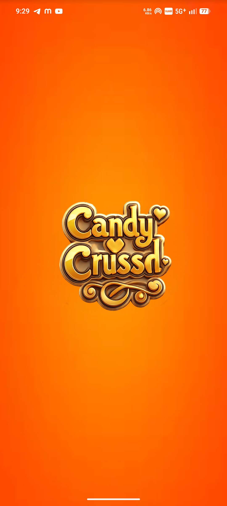
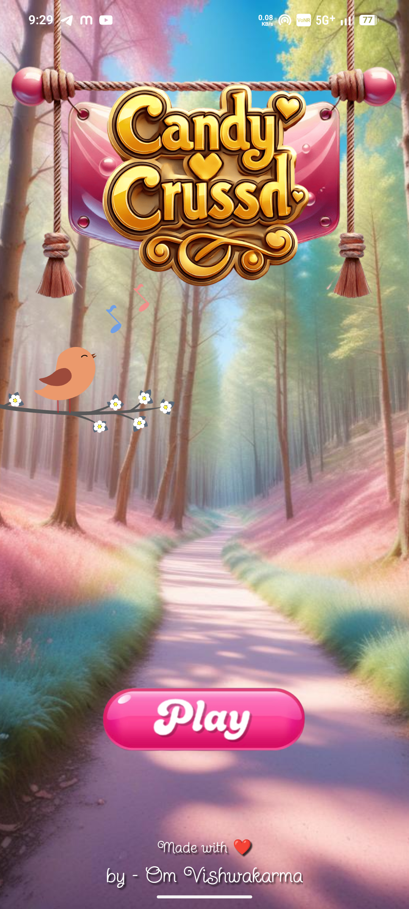
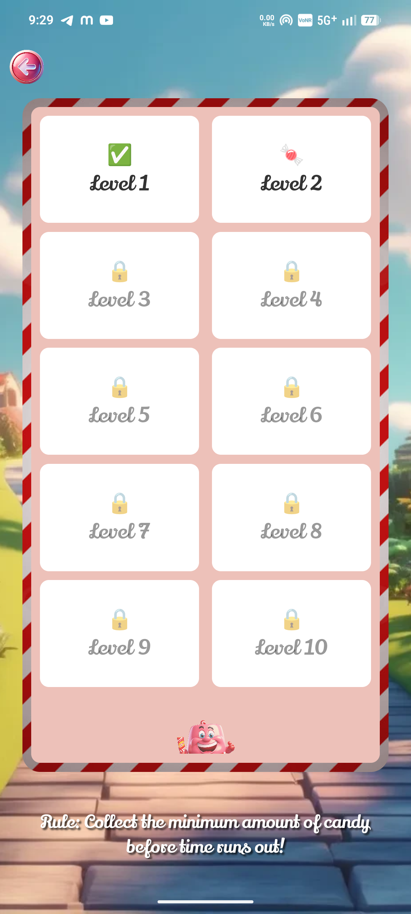
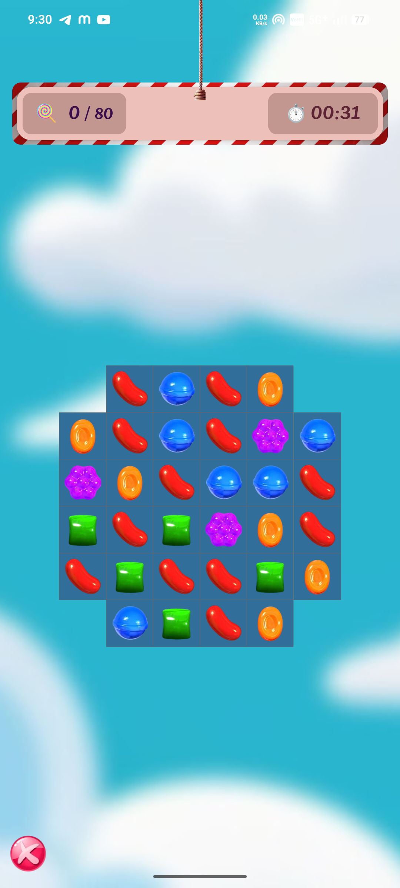

# 🍬 Candy Crush React Native

Welcome to the **Candy Crush** clone! This project is a high-performance mobile game built with **React Native 0.85**, leveraging modern libraries like **Reanimated 4** for fluid animations and **Zustand** for lightning-fast state management.

---

## 🚀 Features

* **Silky Smooth Animations:** Powered by `react-native-reanimated` and `lottie-react-native`.
* **High Performance:** Uses `react-native-mmkv` for instant data storage and `react-native-nitro-modules`.
* **Immersive Audio:** Integrated sound effects using `react-native-sound-player`.
* **Modern Navigation:** Seamless screen transitions with `react-navigation` v7.
* **Responsive UI:** Perfectly scaled on all devices via `react-native-responsive-fontsize`.

---

## 🛠️ Tech Stack

| Category | Libraries |
| :--- | :--- |
| **Framework** | React Native 0.85.2, React 19 |
| **Styling** | React Native SVG, Responsive Fontsize |
| **State** | Zustand |
| **Animations** | Reanimated 4, Lottie |
| **Storage** | MMKV |
| **Multimedia** | Video, Sound Player |

---

## 📦 Installation & Setup

1.  **Clone the repository:**
    ```bash
    git clone https://github.com/ohm-vishwa/candy-crush.git
    ```
2.  **Install dependencies:**
    ```bash
    npm install
    # or
    yarn install
    ```
3.  **iOS Setup:**
    ```bash
    cd ios && pod install && cd ..
    ```
4.  **Run the app:**
    ```bash
    npx react-native run-android # For Android
    npx react-native run-ios     # For iOS
    ```

---

## 📥 Download App

Ready to play? Get the latest build here:

👉 [Download Candy Crush apk](https://github.com/ohm-vishwa/candy-cursh/releases/download/apk/candy-crush-ohm.apk)

---

## 📸 Screenshots





---

---

### 🍭 Sweet Thanks!

Thank you for checking out this project! If you enjoyed playing or exploring the code, feel free to ⭐ the repo. 

**Happy Crushing!** 🍬✨